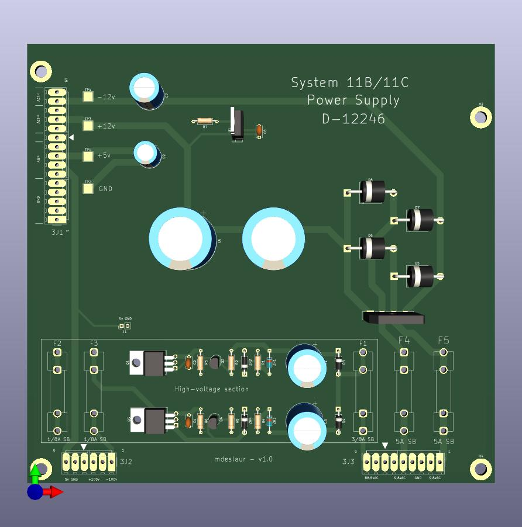

# Williams System 11B/11C Power Supply

This is a replacement power supply for use in Williams System 11B/11C
pinball machines. The original part number is D-12246.

When being used with low-voltage LED displays, all parts in the 100v
sections can be left unpopulated.

It is in KiCad 7 format.

See Docs/parts-list.txt for a list of parts. Make sure the regulator is
installed the right way. The square pad is pin 1, and the pin numbers are
printed on it. Also, you can use either the bridge rectifier, or individual
diodes, don't install both.

The gerbers for JLCPCB are in the zip file in the gerbers directory.

This has been lightly tested in a Williams Taxi with low-voltage LED
displays. The high-voltage section has not been tested, so please let me
know if it works.

Change history:  
1.0 - Initial version  

To Do:  
- Change silkscreen for regulator to better indicate orientation

Marc Deslauriers
2024-01-31
